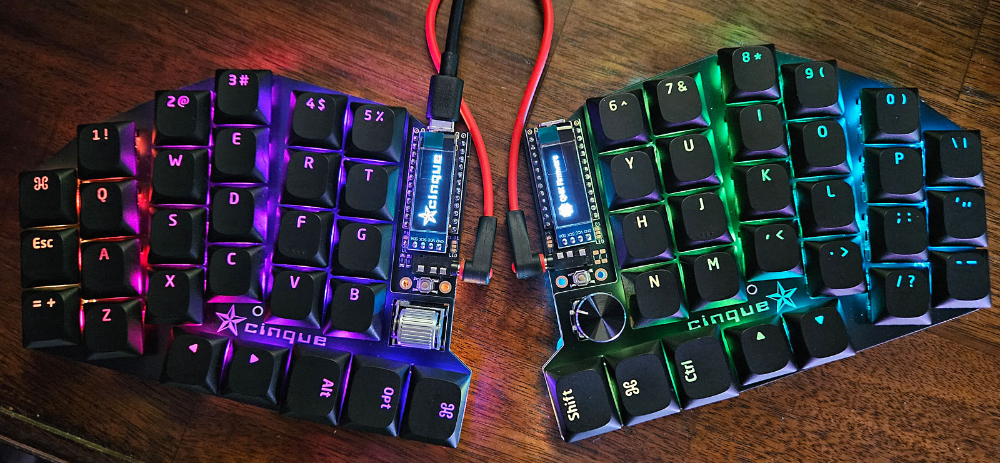
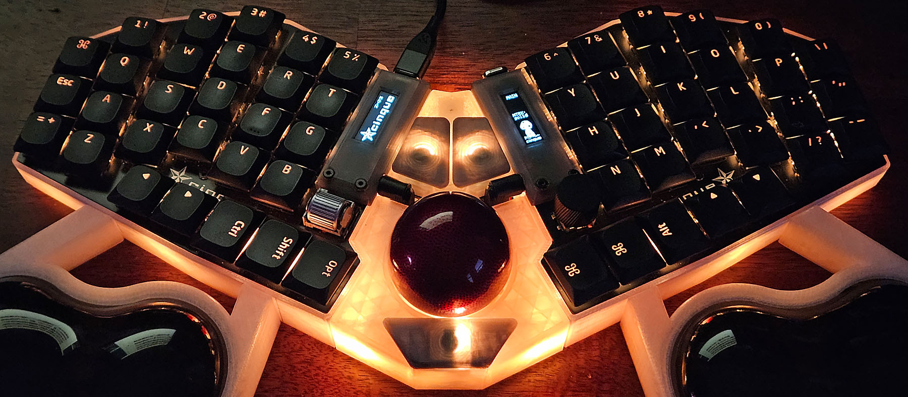
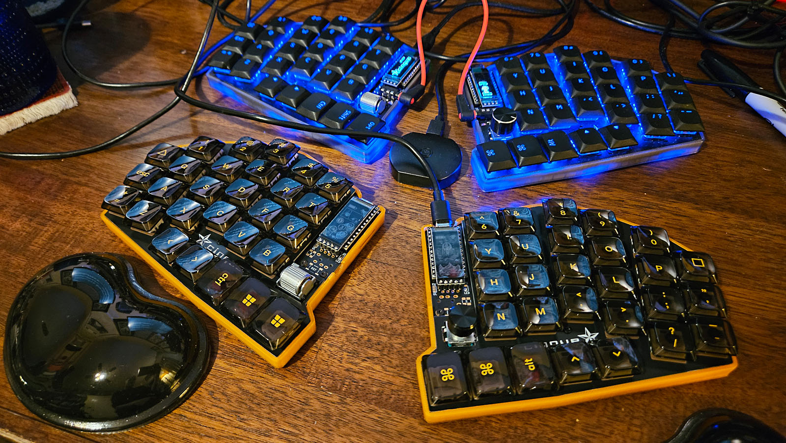

# cinque 
### (\[ˈt͡ʃin.kwe\] or \[sĭngk\], your choice)
cinque is an open-source 56-key compact staggered low-profile split ortholinear 
mechanical RGB keyboard and trackball project 
designed in [Ergogen](https://ergogen.xyz/)
laid out in [KiCad](https://www.kicad.org/)
with cases modeled in [FreeCAD](https://www.freecad.org/)
and driven by [QMK](https://qmk.fm/)
or [ZMK](https://zmk.dev/)
firmware. 
The project was inspired by (and borrows *heavily* from) the
[Corax](https://github.com/dnlbauer/corax-keyboard), 
[Atreus](https://atreus.technomancy.us/),
[Sofle](https://josefadamcik.github.io/SofleKeyboard/) and 
[Lily58](https://github.com/kata0510/Lily58) projects
and features footprints designed or inspired by [ceoloide](https://github.com/ceoloide/ergogen-footprints),
[infused-kim](https://github.com/infused-kim/kb_ergogen_fp),
and [dnlbauer](https://github.com/dnlbauer/corax-keyboard/tree/main/corax56/ergogen/footprints)

### Hardware
cinque is built around paired ProMicro controllers,
employing RP2040 (wired) to drive the trackball and RGB
or NRF52840 (Nice!Nano) for low-power battery Bluetooth connectivity.
other MCUs and configurations are viable.
- **Switches:** Gateron KS-33 low-profile (MX stem) hot-swap
- **Rotary:** EC11 or Panasonic EVQWGD001 (horizontal) per side
- **Trackball:** PMW3389 via [Joe's Sensors and Sundry](https://www.tindie.com/products/citizenjoe/pmw3389-motion-sensor/) module
- **RGB:** SK6812 per-key and 3535 down lights
- **Display:** 0.91" I2C OLED or Nice!View (low-power) LCD (via custom footprint)

### [Build Guide](build.md)

### [The Story](story.md)

### Versions
**1.0:**
The initial one-sided version (202410) is intended to enable a large number of possible features
and configurations to support the incremental development of cases, supports, 
and trackball integration. No significant issues have been discovered.
- The EC11 switch plate cutout is too small and requires filing for the board connectors

### Future Tweaks
- Move/change TRRS
- Large battery single side charge via Schottky diode and shared power switch 
- Trackball with mouse (small) switches
- Kailh Choc (or other switch?) version
- Consider central (on board?) controller(s) with connected peripherals

cinque is licensed under an [MIT license](LICENSE).
