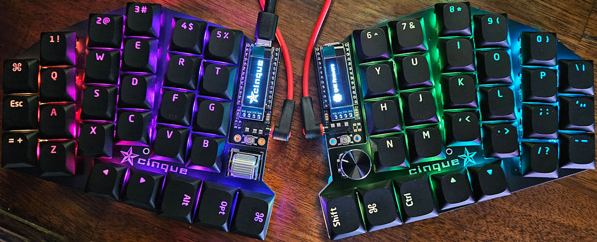

# cinque 
### (\[ˈt͡ʃin.kwe\] or \[sĭngk\], your choice)
cinque is an open-source 56-key compact columnar staggered low-profile split 
mechanical keyboard and trackball with RGB lighting and rotary encoders
designed in [Ergogen](https://ergogen.xyz/)
laid out in [KiCad](https://www.kicad.org/)
with cases modeled in [FreeCAD](https://www.freecad.org/)
and driven by [QMK](https://qmk.fm/)
or [ZMK](https://zmk.dev/)
firmware. 
The project was inspired by (and borrows *heavily* from) the
[Corax](https://github.com/dnlbauer/corax-keyboard), 
[Atreus](https://atreus.technomancy.us/),
[Sofle](https://josefadamcik.github.io/SofleKeyboard/) and 
[Lily58](https://github.com/kata0510/Lily58) projects
and features footprints designed or inspired by [ceoloide](https://github.com/ceoloide/ergogen-footprints),
[infused-kim](https://github.com/infused-kim/kb_ergogen_fp),
and [dnlbauer](https://github.com/dnlbauer/corax-keyboard/tree/main/corax56/ergogen/footprints)

### Hardware
cinque is built around paired ProMicro controllers,
employing RP2040 (for wired, trackball, RGB, OLED)
or NRF52840 (for battery, Bluetooth, Nice!Nano).
Other MCUs and configurations are viable.
- **Switches:** Gateron KS-33 low-profile (MX stem) hot-swap
- **Rotary:** EC11 or Panasonic EVQWGD001 (horizontal) per side
- **Trackball:** PMW3389 module and Gateron KS-33 switches 
- **RGB:** SK6812 per-key and 3535 underglow lights (including trackball)
- **Display:** 0.91" I2C OLED or Nice!View (low-power) LCD (via custom footprint)

### Firmware
- [QMK](qmk/cinque/README.md) (for RP2040)
- [ZMK](https://github.com/swaziloo/cinque-zmk-config) (for NRF52840)

### [Build Guide](build.md)

### [The Story](story.md)

### Versions
**1.0:**
The initial one-sided version (202410) is intended to enable a large number of possible features
and configurations.
- The EC11 switch plate cutout is too small and requires filing to accommodate the board connectors (fixed 1.1)
- NRF52840 P1.01 Nice!View CS pin option is untested
- I2C split communication is untested
- Right-side FPC (trackball) is untested

**1.1:**
(switch plate only at this time&mdash;202506)
Adds 1.25x8mm and 1.5x8mm side expansions to accommodate the EC11 connectors on the cutout.

### Future Development
- Move/change TRRS
- Large battery single side charge via Schottky diode(?) and shared power switch 
- Trackball with mouse (small) switches
- 34mm trackball (maybe)
- Kailh Choc, Cherry MX, (or other switch?) version
- Consider central (on board?) controller(s) with connected peripherals
- Find or design a horizontal encoder replacement for the Panasonic

cinque is licensed under an [MIT license](LICENSE).
