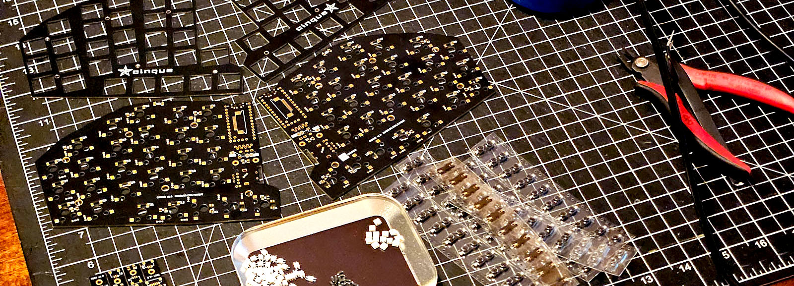
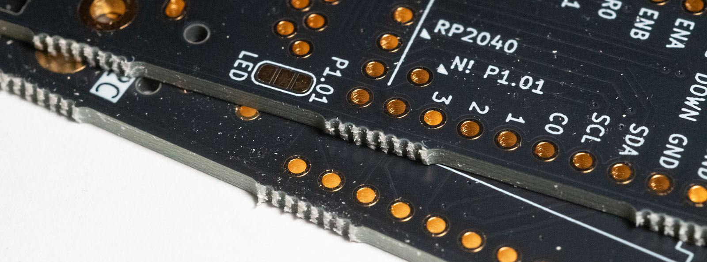
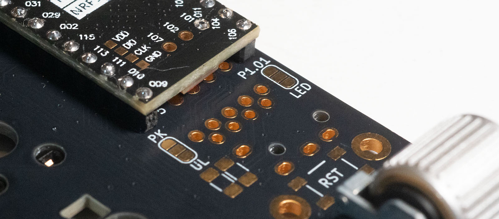
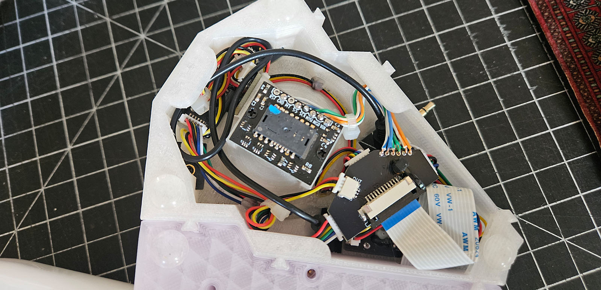

# Building cinque
> **Tip:** This guide assumes familiarity with custom keyboard builds.
> For information on building this type of keyboard, the detailed build guide for the
> [Sofle Choc](https://brianlow.notion.site/Sofle-Choc-Build-Guide-c4bbbaece6e746f7a5956842af567e79)
> and the build guides for 
> the [Lily58 Pro](https://github.com/kata0510/Lily58/blob/master/Pro/Doc/buildguide_en.md)
> the [Sofle RGB](https://josefadamcik.github.io/SofleKeyboard/build_guide_rgb.html)
> and [Corax](https://github.com/dnlbauer/corax-keyboard/blob/main/docs/BuildGuide.md)
> can provide the basic instructions.

The first step is to determine configuration and options and ensure that the ProMicro and power scheme will support them. 
I've built two configurations so far: RP2040 ProMicro (wired) with full RGB/Trackball/OLED (similar to Sofle Choc) 
and NRF52840 ProMicro with Nice!View and battery power (similar to Corax).

## Keyboard Parts
| Item            | Quantity | Detail                                                                                                                                                                                                                                                                                               |
|-----------------|----------|------------------------------------------------------------------------------------------------------------------------------------------------------------------------------------------------------------------------------------------------------------------------------------------------------|
| PCB             | 1        | A single 1.6mm panel provides both halves of the keyboard and 8 small breakout boards for the trackball                                                                                                                                                                                              |
| Switch Plates   | 2        | 1.2mm plates with a cutout matching the intended encoder. note that the current pcb panel includes one of each style                                                                                                                                                                                 |
| ProMicro        | 2        | For wired QMK/RGB builds, RP2040 with the extra 5 pins at the bottom. For wireless/Nice!View the NRF52840 development board. I used (and the extra pins are aligned to) the Tenstar Robot version from AliExpress. Other ProMicro boards should be viable.                                           |
| Switches        | 58       | Gateron KS-33 low-profile mechanical switches                                                                                                                                                                                                                                                        |
| Hotswap Sockets | 58       | Gateron KS-33 hotswap sockets                                                                                                                                                                                                                                                                        |
| Diodes          | 60       | 1N4148 SOD-123 (or equivalent) SMD diodes                                                                                                                                                                                                                                                            |
| Keycaps         | 58       | MX stem low-profile or LDA                                                                                                                                                                                                                                                                           |
| Per-key RGB     | 58       | (optional) [SK-6812-E](https://www.digikey.com/en/products/detail/adafruit-industries-llc/4960/14302512)                                                                                                                                                                                             |
| Underglow RGB   | 14       | (optional) [3535 SMD RGB](https://www.digikey.com/en/products/detail/inolux/IN-PI33TBTPRPGPB/9681238)                                                                                                                                                                                                |
| Encoders        | 2        | (optional) EC11 (recommend 30 PPR 9.5mm height) with 13-16mm knob or Panasonic EVQWGD001 on either side                                                                                                                                                                                              |
| Displays        | 2        | (optional) 0.91" I2C OLED or Nice!View                                                                                                                                                                                                                                                               |
| Reset Switches  | 2        | Two options supported [SM1207SM](https://www.digikey.com/en/products/detail/cit-relay-and-switch/CS1207SMF160/16607829) along the top edge/underside of the PCB and/or [SKQGABE010](https://www.digikey.com/en/products/detail/alps-alpine/SKQGABE010/19529161) between the mounts above the encoders |
| TRRS Jack       | 2        | If using wired connection. Plus TRRS cable                                                                                                                                                                                                                                                           |
| Power Switch    | 2        | (For battery powered boards) [SPDT Slide Switch SMD](https://www.digikey.com/en/products/detail/alps-alpine/SSSS811101/19529062)                                                                                                                                                                     |
| Battery         | 2        | (For battery powered boards) 3.7v LiPo 110mAh 301230 or larger, depending on placement                                                                                                                                                                                                               |
| Hardware        | *        | m2 inserts, screws, and standoffs vary depending on case and configuration. Use adhesive rubber feet to prevent sliding.                                                                                                                                                                             |

## Trackball Parts
| Item                  | Quantity | Detail                                                                                                   |
|-----------------------|----------|----------------------------------------------------------------------------------------------------------|
| PCB                   | 8        | 1.6mm breakout boards from keyboard                                                                      |
| Switches              | 3        | Gateron KS-33 low-profile mechanical switches                                                            |
| Diodes                | 3        | 1N4148 SOD-123 (or equivalent) SMD diodes                                                                | |
| Per-key RGB           | 3        | (optional) [SK-6812-E](https://www.digikey.com/en/products/detail/adafruit-industries-llc/4960/14302512) |
| Underglow RGB         | 4        | (optional) [3535 SMD RGB](https://www.digikey.com/en/products/detail/inolux/IN-PI33TBTPRPGPB/9681238)    |
| JST SH 1.0 SMD Socket | 14       | 8x 3-pin horizontal, 3x 6-pin horizontal, 3x 6-pin vertical                                              |
| JST SH 1.0 Cable      | 7        | 4x 3-pin 10cm reverse, 3x 6-pin 10cm reverse                                                             |
| FPC 1.0               | 3        | 2x 12-pin SMD, 1x 10cm ribbon (same side)                                                                |
| SiO2 Bearings         | 6        | 3x 2.5mm and 3x 3.0mm                                                                                    |
| Trackball             | 1        | 44mm =                                                                                                   |

## Guidelines
*Be very careful separating the panel!* 
There are traces close to the edge. 
It is wise to score the mouse bites before breaking apart, particularly along the inside edge.

Mouse bites scored with a box knife blade.

Separated board will have jagged edges.
Recommend cautious grinding with a sanding wheel on a dremel.

Board edge smoothed and ready for assembly.

The board only features two soldered jumpers.
In both cases, connect the center pad with one options.
- **PK---UL** determines whether the RGB signal sent to the trackball runs off the end of the per-key (28) set or after the underglow (35). 
  - Only solder the jumper on the side that will drive the trackball RGB.
  - Not needed if not using the trackball with RGB.
- **P1.01---LED** determines the CS pin if using the Nice!View display. 
  - Note that if hacking a Nice!View with another MCU and RGB (LED) in use, any pin that can handle CS can be soldered to the P1.01 socket under the ProMicro.

The density of this board can make hand soldering tricky in places.
I recommend beginning with the 3535 underglow RGB since it can be difficult to hand solder those short pads.

For example, this underglow LED has a bad solder point and needed to be reflowed.
It was not the only one.
Note that the LEDs worked fine&mdash;the soldering was challenging.

When using heat-melt inserts and standoffs, take care to ensure that the total height above the case is 5.9mm for all 6 through-hole mounts and 3.0mm for both direct/cover mounts.
If using a "sandwich" style case, use 6.0mm standoffs between bottom and top plates, and 3.0mm standoffs from the bottom to middle plate.

 
The trackball bearings are fixed SiO2 spheres that you melt into the printed housing.
Use a thick insert tool or similar object heated to 200c (400f) to gently press them into place while checking the clearance from the ball to the bottom mounting surface. 
It should be as close as possible to 2.0mm.
Begin with the bottom three 2.5mm and get them perfect, then add the top 3.0mm and sink them until the ball just barely tips into them when pushed from the side.

When assembling the trackball breakout boards, take care to keep components from overhanging the edges.
Test components before screwing or gluing them into the housing and be sure you're using "reversed" cables (pins are the same on both ends, not flipped).

Start with the switch plates. Use a dab of hot glue on two sides to secure them.
The middle, front RGB can face up or down.

The wiring from the PMW3389 breakout to the connector board should be apparent.
The "RST" and "MT" connections are unused.
The FPC ribbon will be a little long.
Recommend a thin, short TRRS cable that will wrap around the other components.

If you've read this far, note that I'll happily respond to any questions you have about building any of this.
No matter your prior experience or skill level.

