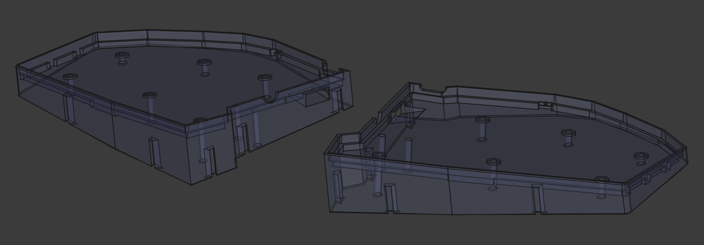
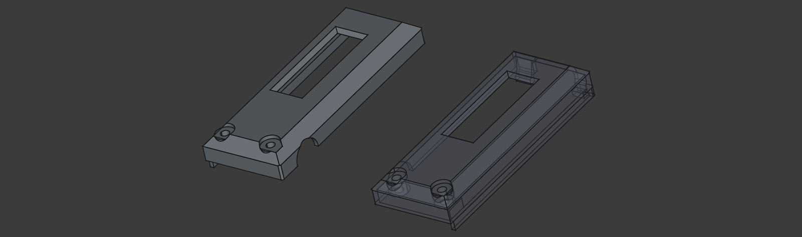
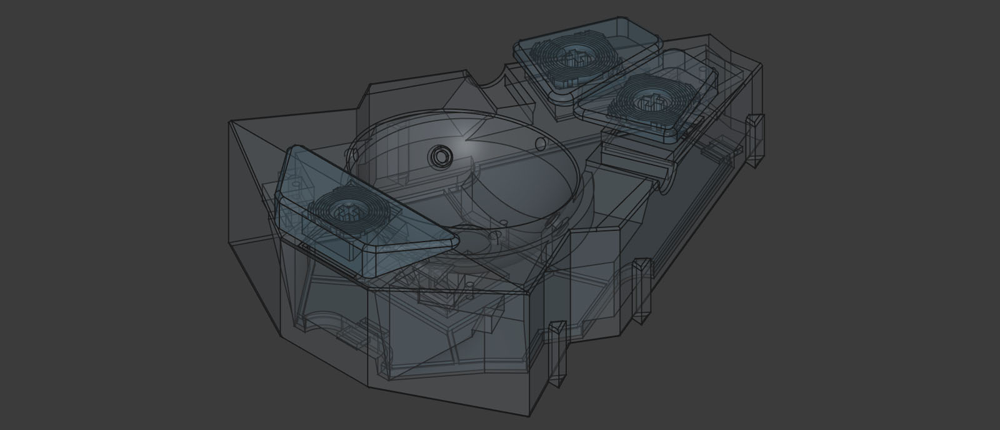
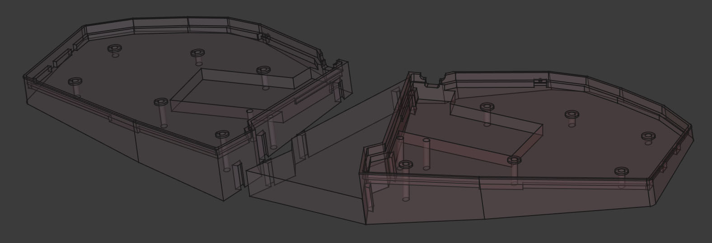
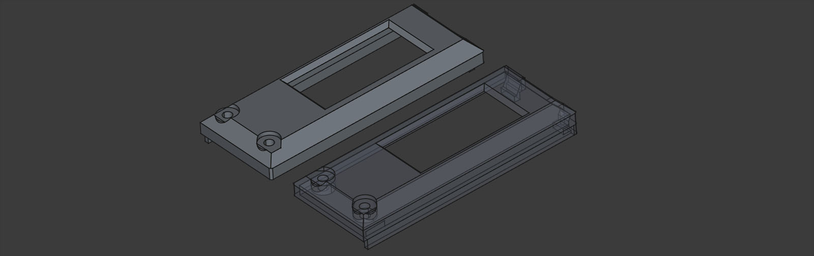
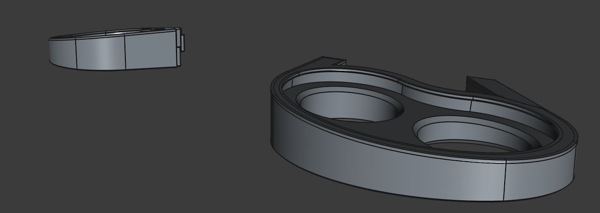
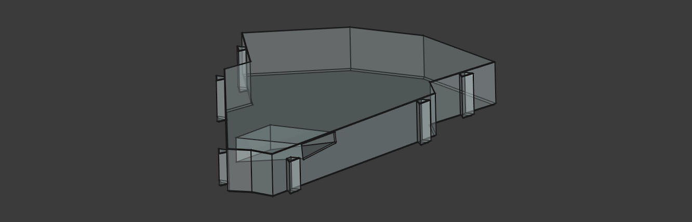

# cinque Case Files
cinque cases are designed and drafted in [FreeCAD](https://www.freecad.org/) 1.0.1
with the intention of being produced on a 3D printer.
Add supports where needed.

stl files can be previewed, measured, and inspected in the [ONLINE 3D VIEWER](https://3dviewer.net/)

|   |                                                                                                                                                                                                                                                          |
|---|----------------------------------------------------------------------------------------------------------------------------------------------------------------------------------------------------------------------------------------------------------|
|  | v1.0 22mm negative tilt for wired boards. Print right-side up.                                                                                                                                                                                           |
|  | v1.0 covers for OLED displays (use 5mm m2 standoffs). Print upside-down.                                                                                                                                                                                 |
|  | v1.0 trackball with keycaps and base cover. Print housing upside-down with supports. Print keycaps with the stem turned 45-degrees upwards and enough supports to handle the keys tilted on their edge. Print cover right-side up with suports for tabs. |
|  | v1.0 22mm negative tilt for wireless boards. Print right-side up. Includes minimal spacer for v1.0 22mm negative tilt boards.                                                                                                                            |
|  | v1.0 covers for Nice!View displays (use 5mm m2 standoffs). Print upside-down. Take care snapping clips under the top of the ProMicro.                                                                                                                    |
|  | v1.0 7x11cm jelly wrist rest holders. Print with supports.                                                                                                                                                                                               |
|  | v1.0 trackball-sized spacer with ribbon cutout.                                                                                                                                                                                                          |

I do not have a current minimalist "flat" case but could easily add one on request.
