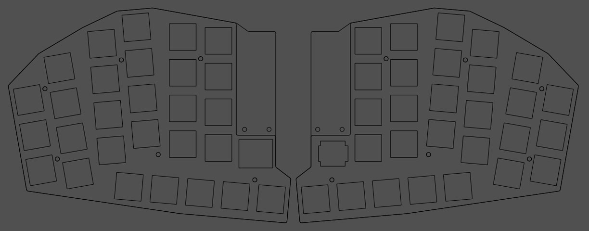

# cinque Ergogen files
cinque was built on [Ergogen](https://ergogen.xyz/) 4.1.0 using footprints from
[ceoloide](https://github.com/ceoloide/ergogen-footprints) and
[dnlbauer](https://github.com/dnlbauer/corax-keyboard/tree/main/corax56/ergogen/footprints).

In order to build the Ergogen assets you will need to:
- Install Ergogen locally
- Copy this folder into your Ergogen file structure and rename it `cinque`
- In the `cinque/footprints` subfolder, check out (or copy) both ceoloide and dnlbauer (under `corax`) footprint files
- From the main Ergogen directory execute `src/cli.js cinque` (or equivalent)
- Assets can be found in the `output` folder

