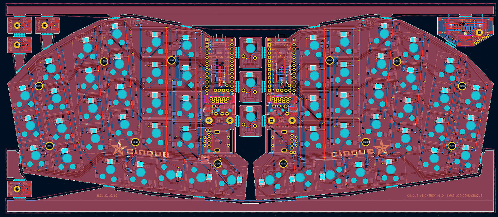
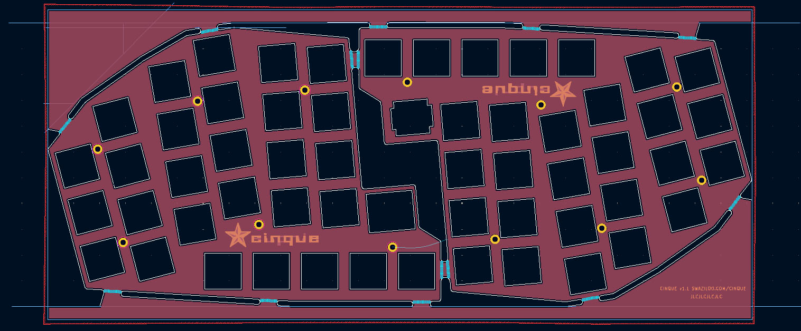

# cinque PCB 

cinque was laid out by hand in [KiCad](https://www.kicad.org/) 8.0.8 from the Ergogen output files.

A single PCB panel will make a keyboard and trackball.

Gerber files were exported according to instructions from [JLCPCB](https://jlcpcb.com/help/article/how-to-generate-gerber-and-drill-files-in-kicad-8).

Let me know if something (footprint library?) doesn't come through, as I haven't previously exported KiCad files.

## cinque Switch Plate

A single switch plate panel provides one EC11 and one EVQWGD001 cutout. These are reversible and can go on either side.

> **Note:** I have extra switch plates available with HASL finish.

## cinque Base Plate

There is no design or files for a base plate at this time (though one could be added.)