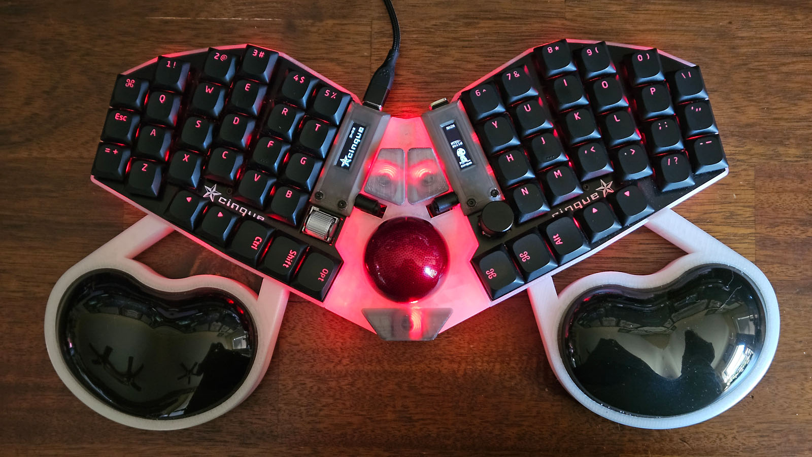
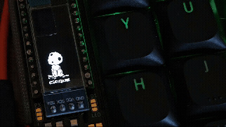

# cinque
*cinque is an open-source 56-key compact staggered low-profile split ortholinear mechanical RGB keyboard with rotary encoders and trackball*

* Keyboard Maintainer: [swaziloo](https://github.com/swaziloo)
* Hardware Supported: cinque v1 (wired) with RP2040 ProMicro MCU via chibios
  * Note that the cinque likely works with other ProMicro controllers
* Hardware Availability: [github/swaziloo/cinque](https://github.com/swaziloo/cinque)
* Use [ZMK](https://github.com/swaziloo/cinque-zmk-config) firmware for Bluetooth (NRF52840) builds

*Note that it is recommend to flash your RP2040 ProMicro before soldering it to the board, as the default bootloader may not support double-tap flashing.*

See the [build environment setup](https://docs.qmk.fm/#/getting_started_build_tools) and the [make instructions](https://docs.qmk.fm/#/getting_started_make_guide) for more information. Brand new to QMK? Start with our [Complete Newbs Guide](https://docs.qmk.fm/#/newbs).

## Building the Firmware
* Check out the QMK [qmk firmware](https://github.com/qmk/qmk_firmware) project and configure your environment to compile it.
  * For Windows I recommend [git bash](https://gitforwindows.org/) and the [QMK MSYS](https://msys.qmk.fm/) shell.
* From within your `qmk_firmware` project check out the submodules and run qmk setup: 
```
git submodule update --init --recursive
qmk setup
```

* *If using the trackball*, modify the following lines in the `platforms/chibios/boards/GENERIC_PROMICRO_RP2040/configs/mcuconf.h` file to enable the SPI1 driver:
```
-#define RP_SPI_USE_SPI0                     TRUE
-#define RP_SPI_USE_SPI1                     FALSE
+#define RP_SPI_USE_SPI0                     FALSE
+#define RP_SPI_USE_SPI1                     TRUE
```
* Copy this folder (cinque) to the `qmk_firmware\keyboards` folder.
* To build the firmware for the cinque with RGB support, enter this command in your QMK MSYS terminal from the `qmk_firmware` folder:
```
qmk compile -kb cinque/rp2040rgb -km default
```
* To build the firmware for cinque with RGB and trackball support, enter this command in your QMK MSYS terminal from the `qmk_firmware` folder:
```
qmk compile -kb cinque/rp2040rgbtrackball -km default
```
* The `.uf2` firmware file should be linked and copied to your `qmk_firmware` folder.

## Flashing
Double tap the reset (RST) button on your MCU or board. 
The RP2040 will connect as a USB drive into which you drop the `.uf2` file you just built.
The RP2040 will reconnect as a keyboard once it installs the firmware. Connect and flash both MCUs.

## Bootloader
If the double-tap reset doesn't mount the RP2040 as a drive you may need to hold the physical BOOT button on the front of the MCU while connecting it to your PC.

## Kodama


If you're here for the Kodama, the `kodama.c` and `kodama.h` files should be portable. You'll need 6 lines for the animation which you configure at the top of the `kodama.c` file. Then call `render_animated_kodama();` in your `oled_task_user()` function for the correct OLED.


