| 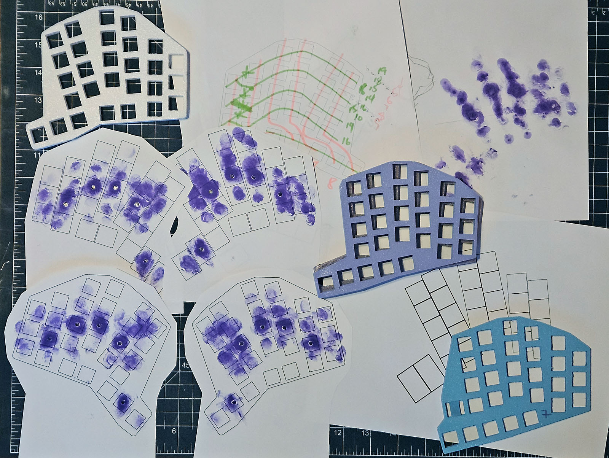 | 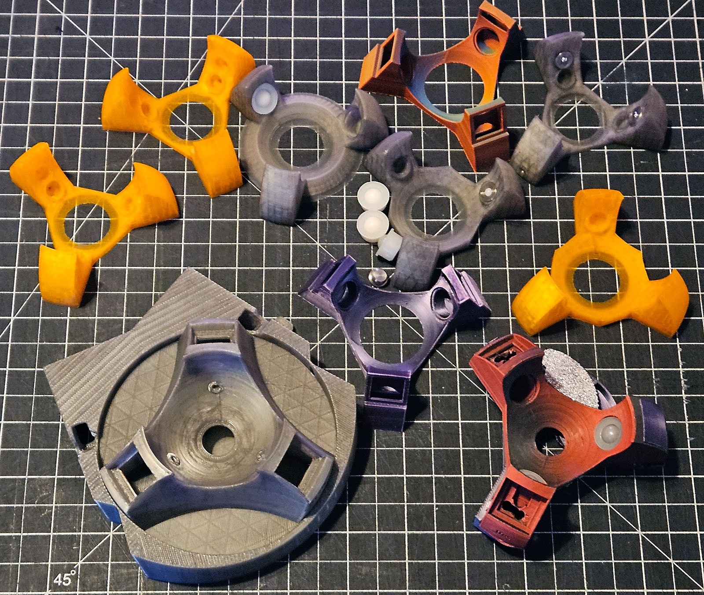 | 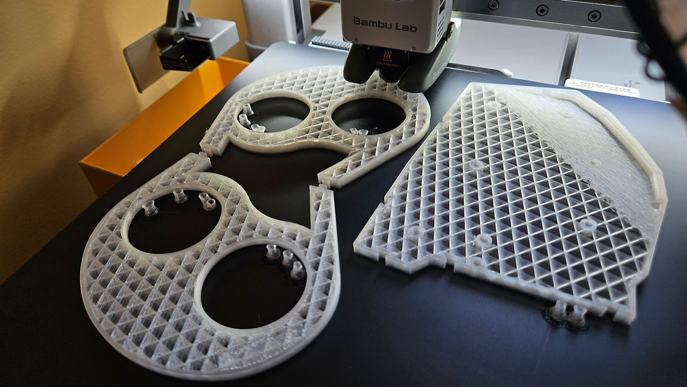 |
|---------------------------------------------|---------------------------------------------|---------------------------------------------|
# The Story
I've used ortholinear and mechanical keyboards for years.
Upon discovering [Ergogen](https://ergogen.xyz/) 
and the [Flat Foot Fox](https://flatfootfox.com/) tutorials 
I began a process of studying the size and shape of my hand
which led to 3D printed switch holders with which I further refined the shape of cinque.

I wanted a compact upgrade akin to my [Atreus](https://atreus.technomancy.us/) keyboard,
since I found it too limiting for a software development daily driver.
My goals were comfort, compact, and trackball.

My efforts moved to learning KiCad and figuring out how to trace a PCB 
(I would ultimately lay out the complete project three times).
I was convinced by a friend that I *must* include matrix RGB lighting.
Originally I planned a reversible board, but separate halves made the FPC trackball connector viable.
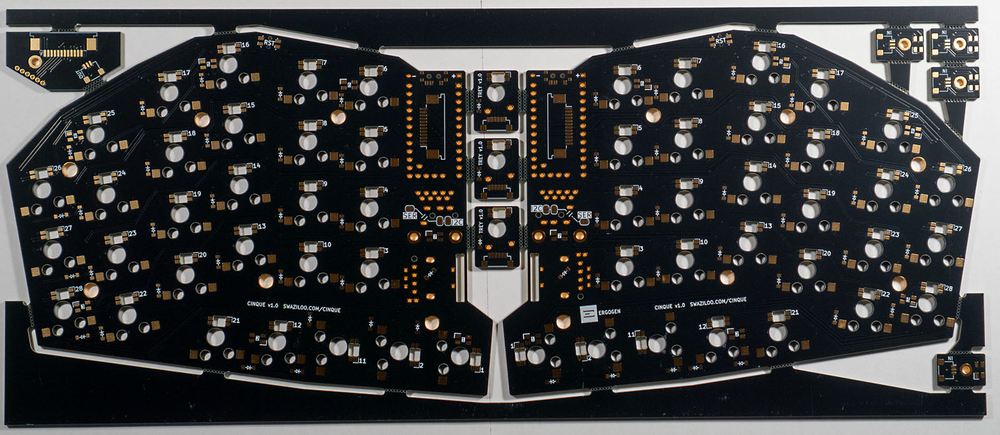

While wrapping up the PCB layout I began testing the trackball integration, 
which I wanted in the middle of the keyboard,
large (originally a 57.25mm billiard ball),
and to "hang off" the extra pins a RP2040 ProMicro would provide.
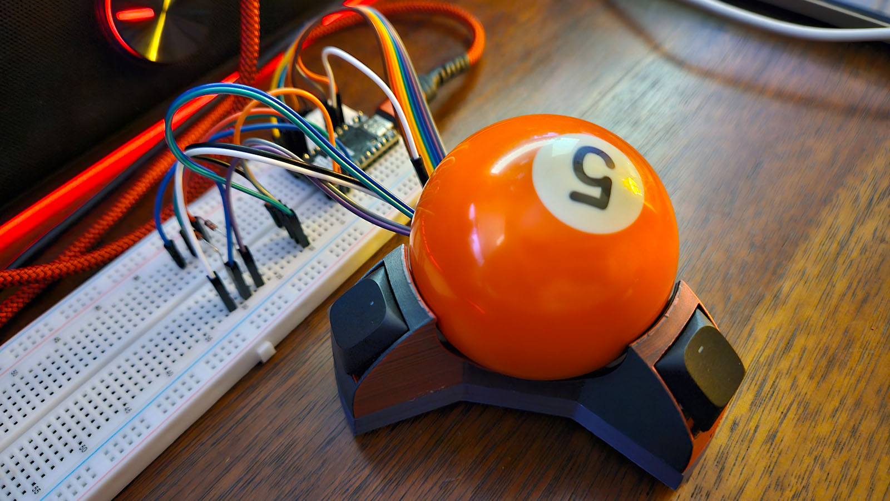

The PCBs would include small breakout boards to mount the switches and lights 
and string it together with JST connectors to support experimenting with the fundamentals of the trackball.

Once I got the PCBs in hand and the first keyboard up and running the job switched to case design.

| 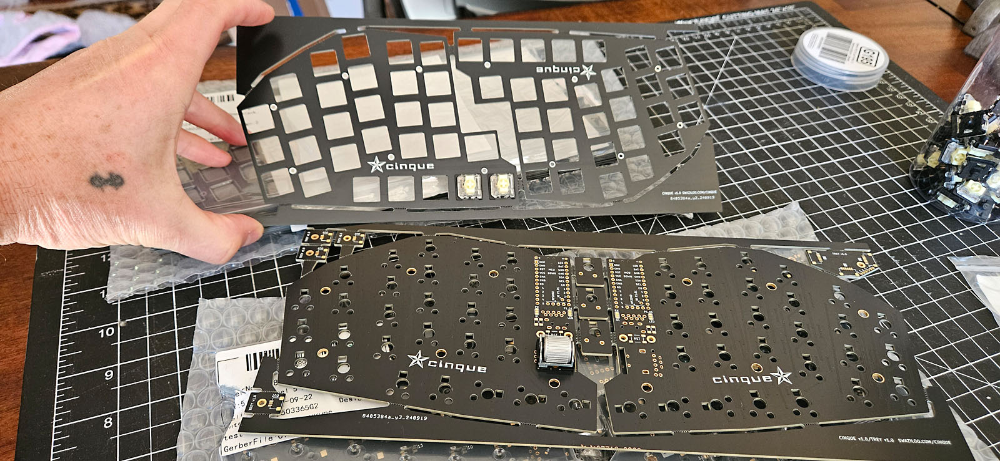                         | 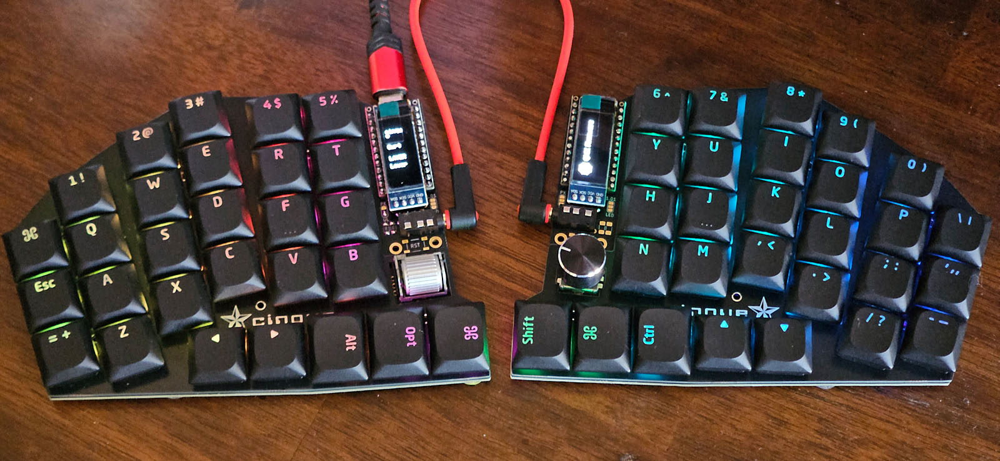                        |
|------------------------------------------------------------------------|---------------------------------------------------------------------|
| 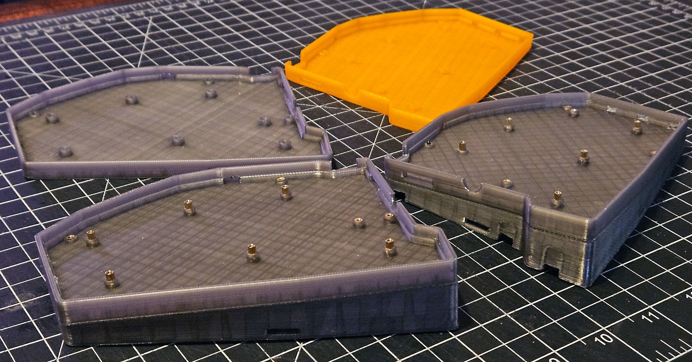                  | 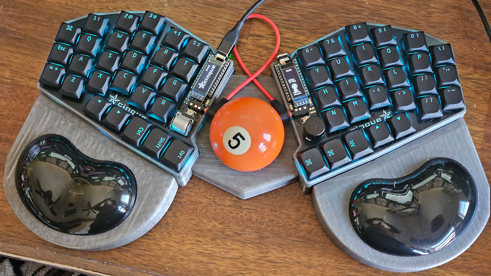 |
| 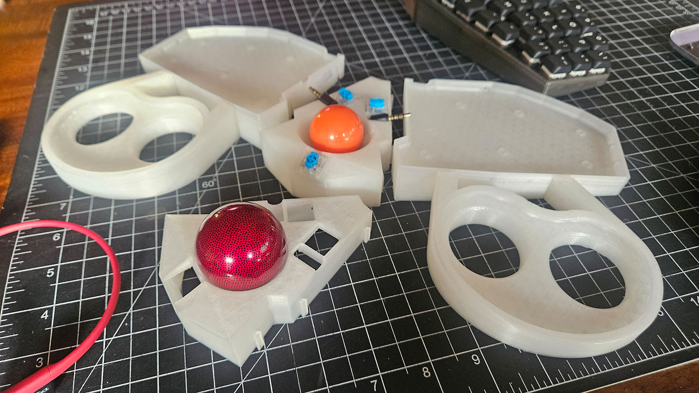 | 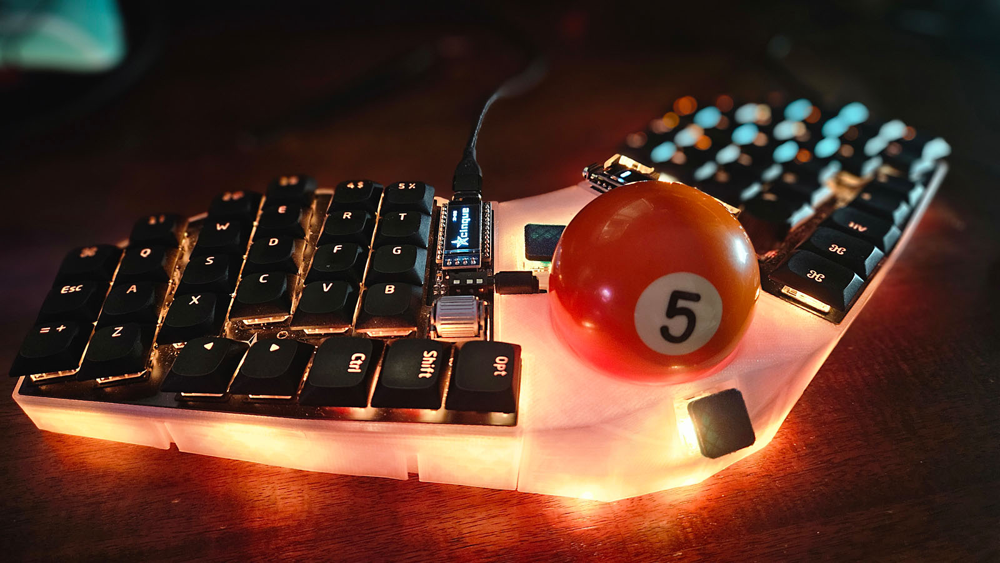                |

Ultimately I ditched the billiard ball,
as it tracked poorly and pushed the keyboard halves apart.

| The trackball housing took a fair bit of trial and error to refine. There's a lot going on in a relatively small space. | 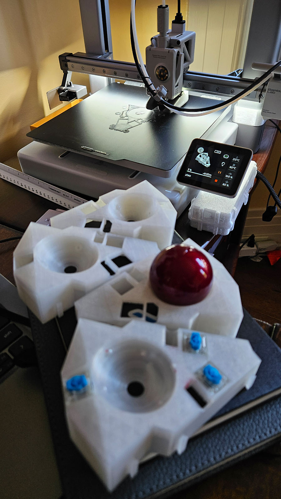 |
|-------------------------------------------------------------------------------------------------------------------------|---------------------------------------------------------------------|

I've also built the wireless/Nice!View "portable" board with a spacer. 
There's room for a large lipo battery beneath each half.

| 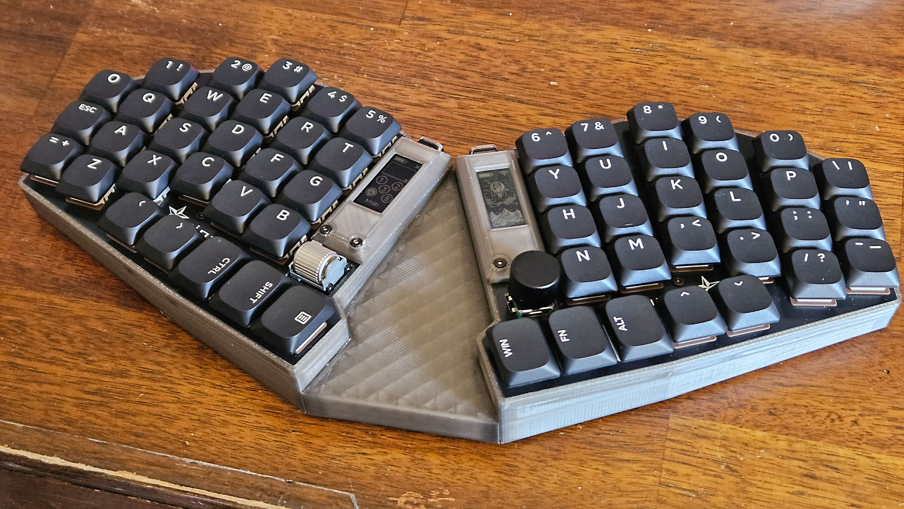 | 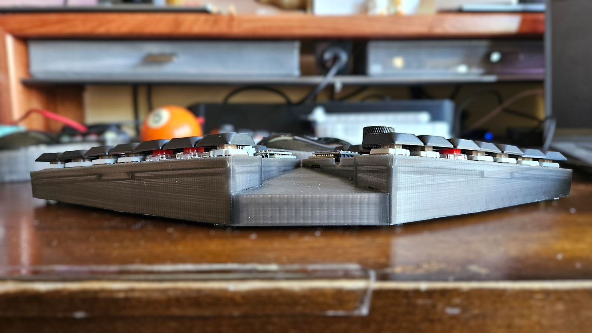 |
|-------------------------------------------|-------------------------------------------|

And here's where things stand in June 2025:

| 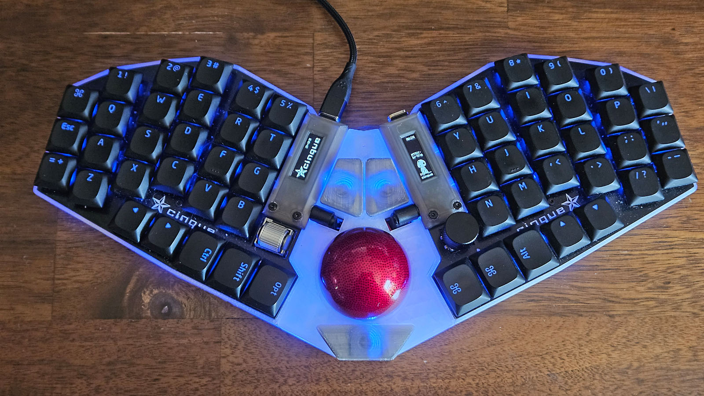 | 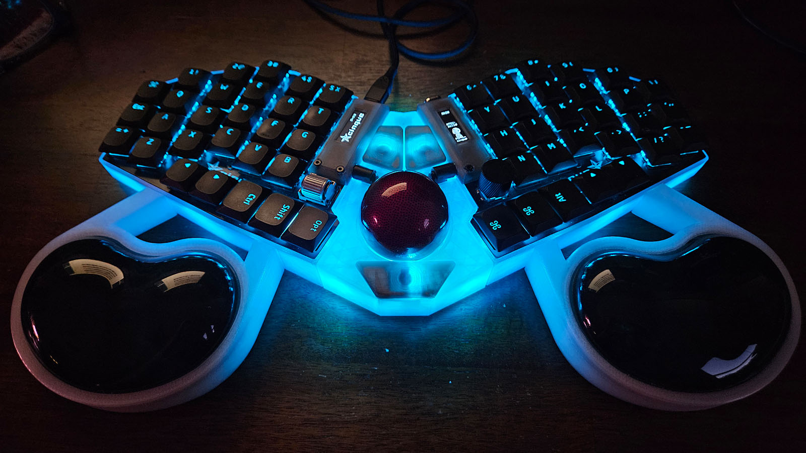 |
|----------------------------------|----------------------------------|
| 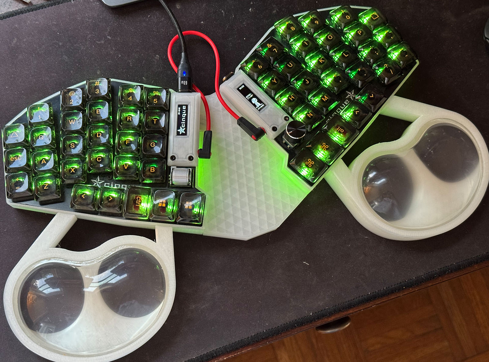 |  |

My sole regret is the TRRS location, though I have been able to manage with some tight tolerances around the trackball.
A future revision may see a change in connector type to support relocation.
Need to give it a think.

Thanks for taking a look. 
Yes, I'm writing all this on the cinque.
Gateron KS-33 Banana are fantastic.
It is my daily driver for work and play.

I appreciate any comments or ideas.

